# Fate Watch Order
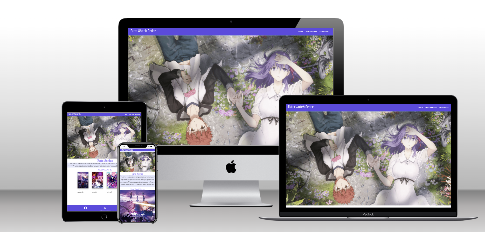
## Website Goal
This website is created for Anime enthusiasts	and potential interested people, who wishes to know more about the anime series. They can visit here to figure out, how to watch this series without going through the headache of multiple searches on other places and feeling confused in terms of the watch order and where to stream them. It’s all in one package as far as being educated with this show concerns.

**Primary Focuses**
- Brief Description of the series
- Growing a following to this series
- Keeping fans excited and delivering information

This Website is made possible by using HTML & CSS as a first Milestone Project for Code Institute's Full Stack Developer course.

[Link to the live Website is here](https://sakixchy.github.io/Fate_Watch_Order/)

___ 

# User Experience (UX)
## User stories 
### As a first-time user
- I want to be enticed at first glance by this website.
- I want to to accomploish my intend of familiarizing myself about the subject.
- I wish to receive updates on forthcoming releases of the anime series.
- I want to be able to navigate around the website with ease and intuitively.

### As a returning user
- I want to be notified about upcoming releases of the anime series.
- I want to keep monitoring my proggression on how far i have watched the series.
- I want to listen to to the official soundtracks of the series.

### All users from mobile devices to desktop can experience this website.

___

# Structure 
## Home
- An attractive image of main characters from the series.
- A consistent theme all around the page.
- Small descriptive of the series in the form of text that delivers an overview.
- Recommendations to movies. 
#### User Goal:
>  - Be delighted by the beautiful aesthetic of the page.
>  - Getting appropriate information based on their curiousity.
#### Website Goal:
>  - Presenting with relevant information and keeping them engaged.
>  - Encouraging viewers to explore other pages.

## Watch Guide
- Main content of the page for viewers to watch.
- External links leads to source of contents for viewers.
- Embedded videos as soundtracks for enjoyment.
#### User Goal:
> - Be able to visit different sites for streaming shows.
> - Can see the progression in the series.
> - Listen to music whilst on the page.
#### Website Goal:
> - Giving visitors a curated watch order to watch the series.
> - Giving visitors a good time during their browsing session.

## Newsletter
- Subscribers receive updates via email depending on content being uploaded.
#### User Goal:
> - Be able to enter name and email to get signed up.
#### Website Goal:
> - Pushing emails to subscribers and feeding updates to clients.

___ 

# Wireframes

### Home
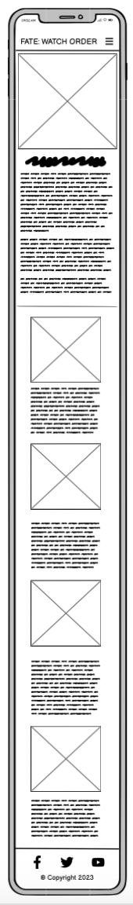
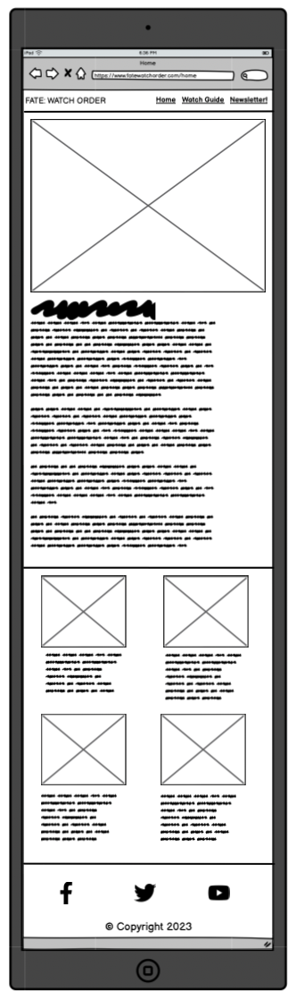
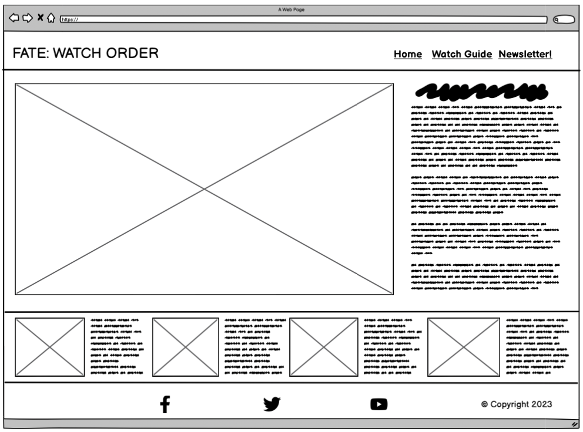

### Watch Guide
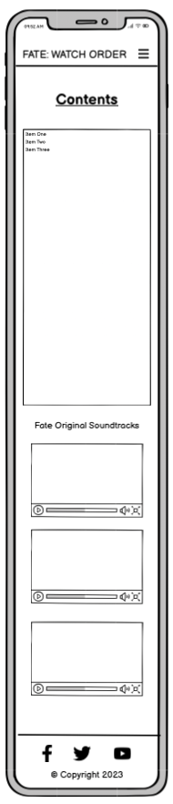
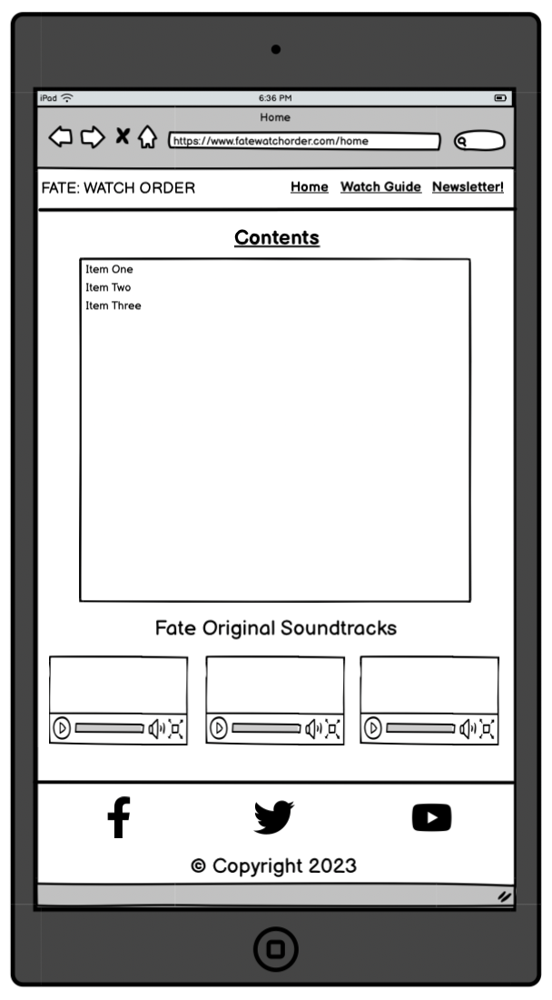
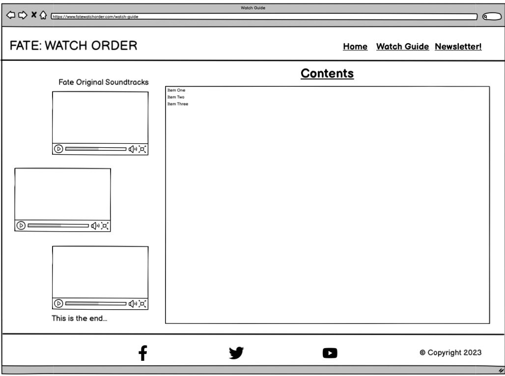

### Newsletter
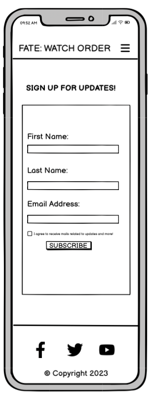
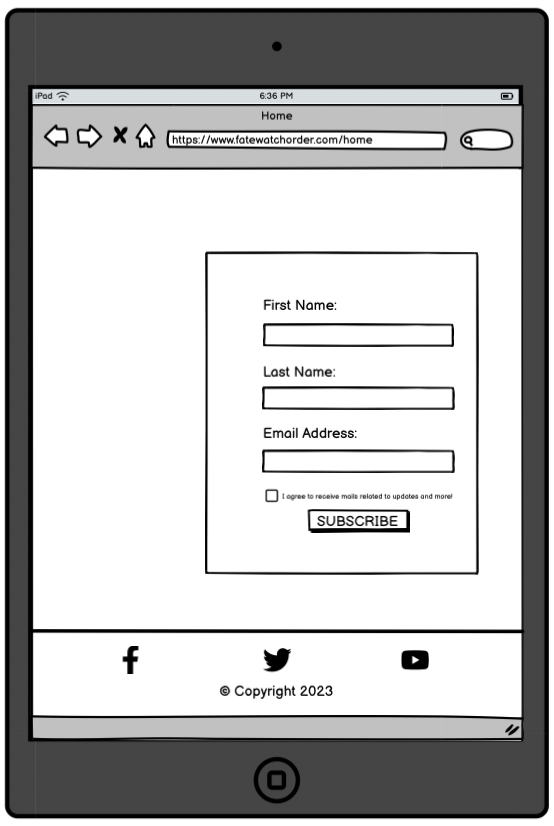
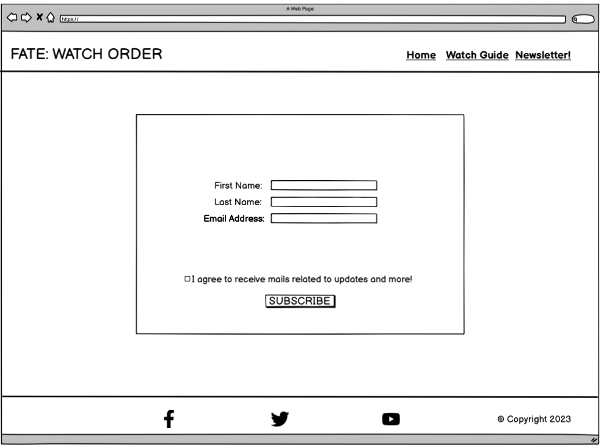

___

# Design 
## Color Scheme
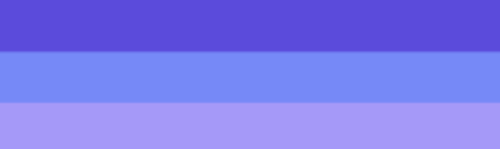  
The choosing of particular color palletes is with the intention of giving the character of feminine and softer tone for positive emotional effect. Generally, Anime fans are youthful and soft hearted, so to utilize this trait and painting the website with these colors is a no brainer.
###### Color Names:
- Cornflower blue 7189ff
- Tropical indigo A698FF
- Majorelle Blue 5e4ae3

# Typography
#### Logo
[handjet](https://fonts.google.com/?query=handjet) font was used for the logo to give it a retro look and give it that distinctive aesthetic in the realm of typical amime styling.
#### Body
[DM Sans](https://fonts.google.com/specimen/DM+Sans?query=DM+Sans) font was used for other segments of the page. It's because the font has an unique outline and extraordinarily thin. This compliments with other aspects of the website, therefore delivering playful experience.

# Images
All images were sourced from various websites pertaining to the topic and picked gracefully.

___

# Features
## Navigation bar
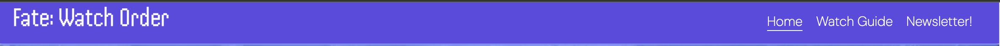
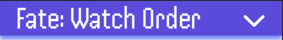  
This navigation bar sits at the top of the website in a sticky position, making it convinient for users to jump through differemt pages. The links to different pages are in one row of line adjacent to eachother.  It's a fully responsive nav-bar, which means no matter what the screen size is, the users won't find it a hassle to navigate.
The nav bar depending on screen size can take different form to better suit smaller devices.
# Home Page
## Hero image
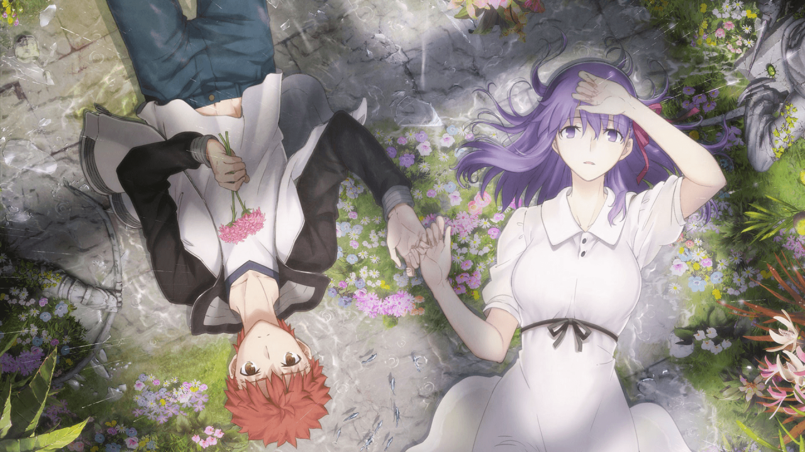  
The "Hero image" as it says, it's an image at the center of attention the moment a user visits the website. It has  
an image of the prominent figures of the series, therefore meking the users fimiliarizing with the whole ethos.

## Must Watch Movies
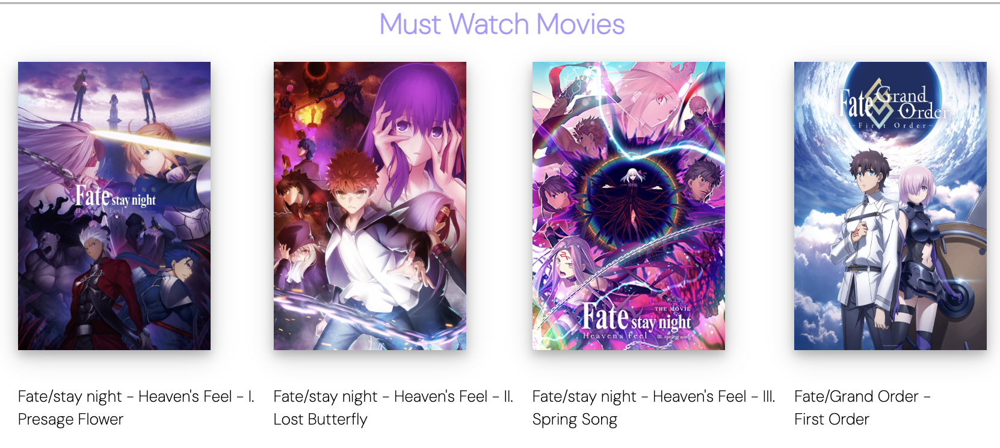 
The recommended movies are very interesting for new comers, hence its given a beautiful outlook as cards to highlight their presence and catch the users attention.

# Watch Guide Page
## Contents
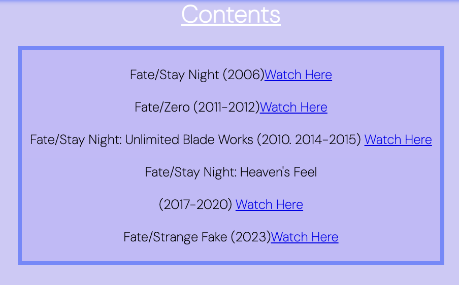 
In the Watch Guide page, a content section is the main source of the website, whereby the user get the appropiate links to watch the series in a proper order.

## SoundTrack
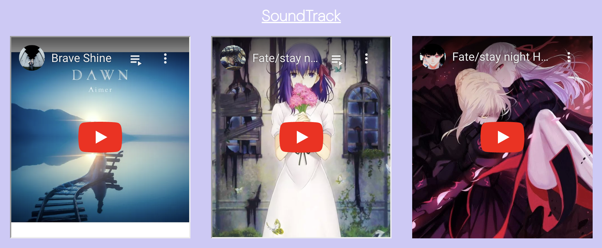 
These are some soundtracks from the series. They are embedded from youtube into the page. The videos can be played with a press of a play and gives the user a nice tune in  experience whilst browsing.

## Newsletter Page
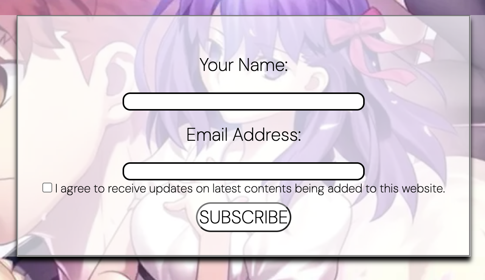 
The page contains a form with name and email input along with a checkbox for agreement. 
The user can fill in the form with their name and email and click subscribe, when an  update or changes being made to the website, the user will be informed with an email. 
(currently, upon subscribing to the newsletter form, the data isn't being stored or processed on the backend as this requires further knowledge of SQL and Python. So this just goes in Code Institute formdump).
___

# Footer
 
The footer has social media links as well as copyright information. The user can follow social mediaa and become closer with the service. General users can be made aware of any rights associated with copyright infringement.

# Responsive layout
The whole website is built bearing other form factors in mind. During initial develiopment of the website, the mobile first approach has been taken. According to which devices is viewed upon, the layout will have a different visual. Flexbox and Display query has been utilized to make the website fluid and resposnive. The three main key devices that this website is based on are: 
- Mobile
- Tablet 
- Desktop

___

# Technologies
- HTML is used to structure the website.
- CSS is used to design and style the website.
- [Gitpod](https://www.gitpod.io/) IDE to work on my website.
- [GitHub](https://www.github.com/) to save code and deploy live website.
- [FontAwesome](https://fontawesome.com/) for icons.
- [Google Fonts](https://fonts.google.com/) for typography.
- [Coolors](https://coolors.co/) is used for choosing color scheme.
- [Balsamiq](https://balsamiq.com/wireframes/?gad=1&gclid=CjwKCAjwo9unBhBTEiwAipC113X24sWLN9_P9LZ-X5AGhpq_VV7aagvL3dAZRIpwDHZNDMB_FVJhQBoCDM4QAvD_BwE) is used to create wireframes.

___

# Testing
## User Story Testing
| Expectations                                                               | Realisation
|----------------------------------------------------------------------------|---------------------------------------------------------------------------------------------------------
| **As a first time user:**                                                  |
| I want to be able to navigate through different pages intuitiv             |At the top there is a navbar withh links to each pages, also a logo that takes back to home.                                                        |
| I want to find the content section and start watching the series.          |The main contents with links are found in middle of the page with title of each series.
| I can play youtube videos.                                                 |The user can play soundtracks by clicking on the play button or press play.
| I can subscribe to newsletter to keep up-to-date.                          |The user can fill in the form and click subscribe button to start receiving mails.
| **As a returning user:**                                                   |
| I can follow up with any new changes made to website.                      |The user will be notified when subscribed and can check the folowing content being chnaged or updated based on the text on email.                                                                          |
| I can see the progression of which links i visited last                 |The user will see a different color of visited links therefore know what has been already watched.
| to watch the series.                                                       |
| I can listen to the soundtracks.                                           |The user can play a song and it will start playing only then and stop when its ended.
|                                                                            | 
| **All users:**                                                             |
| I can view the website across all devices                               | All devices work with this website and is repsonsive, and all functions work preoperly, no features has been left out.

___
# Feature Testing
#### All testing has been done in Chrome, Safari and Firefox.
- I have checked all navigation links working and taking me to appropiate pages. 
- I have checked upon clocking on logo it takes me to home page.
- I have made sure all links in contents section work and take me to an external wesbite in addition open in a new tab. 
- I have checked all youtube videos are playable and not auto playing.
- I have checked the form input works as it should and if a field is missing that it will notify the user. Also, when typing email that it meets the format. 
- I have checked the 'Subscribe' button works and gives the confirmation for form.
- I have checked that all social media links open and in a new tab.

# Bugs
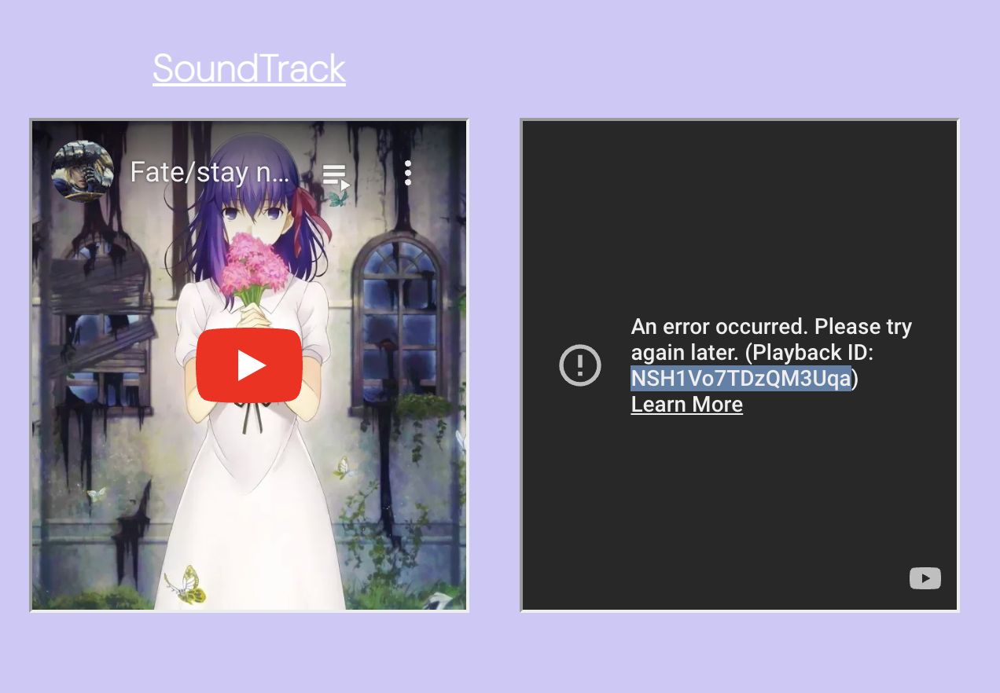 
I found this during my testing and was able to solve this issue by taking the embed source directly from youtube page amd putting the code into html

